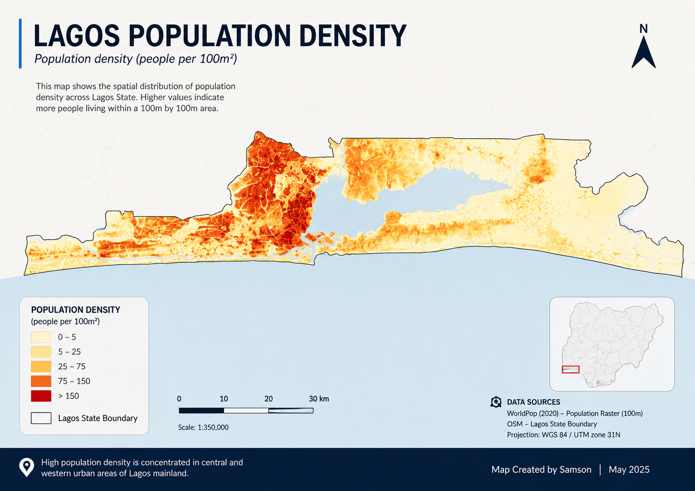

# GIS Portfolio – Samson

A collection of geospatial analysis and mapping projects focused on urban systems, environmental analysis, and spatial intelligence.

---

## 📁 Projects

### 1. Lagos Population Density Analysis

* **Type:** Thematic Mapping (Choropleth)
* **Tools:** QGIS, Python
* **Summary:** Visualization of population distribution across Lagos using raster and administrative boundary data.
* **Insight:** Population density is highest in mainland Lagos, indicating pressure on infrastructure and services in these zones.

[View Project](./projects/lagos-population-density)

---

### 2. Lagos Elevation Analysis (DEM)

* **Type:** Terrain Analysis
* **Tools:** QGIS
* **Summary:** Digital Elevation Model (DEM) visualization of Lagos highlighting terrain variation using hillshade and cartographic styling.
* **Insight:** Despite appearing flat, subtle elevation differences significantly influence flood patterns and drainage systems.

[View Project](./projects/lagos-elevation)

---

### 3. Lagos Flood Risk Analysis

* **Type:** Spatial Risk Modeling
* **Tools:** QGIS
* **Summary:** Identification of flood-prone areas using elevation, hydrology, and spatial analysis techniques.
* **Insight:** Low-lying coastal and lagoon-adjacent areas show higher flood susceptibility.

[View Project](./projects/lagos-flood-risk)

---

## 🧠 Skills Demonstrated

* Spatial Analysis
* Raster & Vector Processing
* Cartographic Design
* Terrain & Elevation Modeling
* GIS + Backend Integration (ongoing)

---

## 🛠️ Tools

* QGIS
* Python (GeoPandas, Rasterio)
* PostGIS (upcoming)

---
