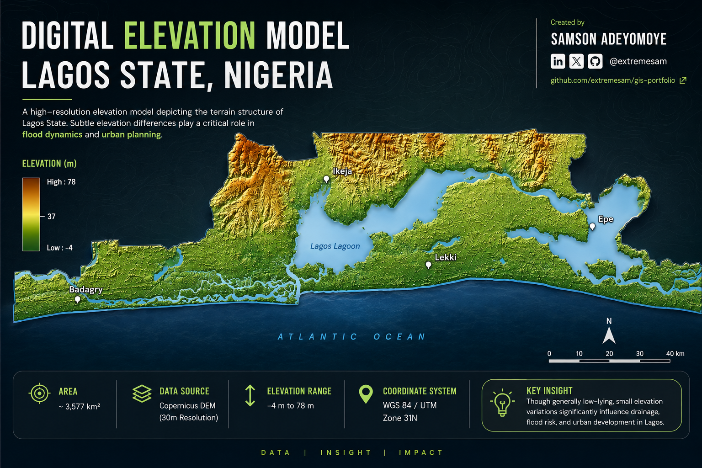

# 🌍 Lagos Elevation Analysis (DEM)

A high-resolution Digital Elevation Model (DEM) visualization of Lagos State, Nigeria, developed to highlight terrain variation and its implications for flood risk, drainage patterns, and urban planning.

---

## 📌 Project Overview

This project presents a terrain analysis of Lagos using DEM data, enhanced with hillshade and cartographic styling to produce a visually intuitive and presentation-ready output.

Although Lagos is generally low-lying, subtle elevation differences significantly influence:
- Flood dynamics
- Surface runoff
- Urban expansion patterns

---

## 🗺️ Study Area

- Location: Lagos State, Nigeria
- Terrain: Coastal, low elevation, lagoon-dominated landscape

---

## 📊 Data Sources

- DEM: Copernicus DEM (30m resolution)
- Projection: WGS 84 / UTM Zone 31N

---

## ⚙️ Methodology

### 1. Data Preparation
- Imported DEM into QGIS
- Clipped to Lagos boundary

### 2. Terrain Enhancement
- Generated hillshade (Azimuth: 315°, Altitude: 45°)
- Applied vertical exaggeration using Z-factor

### 3. Visualization
- Styled DEM using Singleband Pseudocolor
- Applied terrain color ramp (green → brown gradient)
- Blended hillshade using Multiply mode

### 4. Map Composition
- Added water bodies for context
- Designed clean layout for presentation/export

---

## 🎯 Key Insight

Despite appearing flat, Lagos exhibits subtle elevation variations that play a critical role in flood vulnerability and drainage efficiency.

---

## 🛠️ Tools Used

- QGIS (Geospatial analysis & visualization)

---

## 📁 Project Structure
