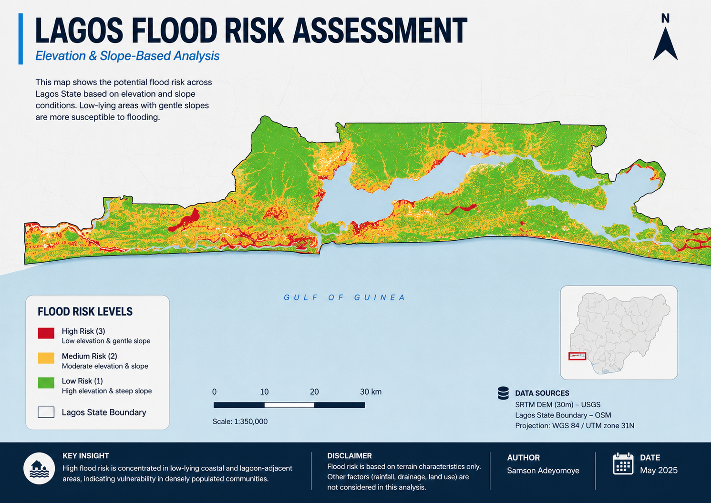

# Lagos Flood Risk Assessment

## Overview

This project evaluates flood risk across Lagos State, Nigeria using a terrain-based approach that combines elevation and slope data. The analysis identifies areas that are more susceptible to flooding and provides insight for urban planning, disaster risk management, and infrastructure development.

---

## Objective

To generate a flood risk map for Lagos State by integrating elevation and slope data in order to:

* Identify high-risk flood zones
* Understand spatial vulnerability patterns
* Support data-driven decision-making for mitigation and planning

---

## Study Area

Lagos State, Nigeria — a low-lying coastal region with lagoons, wetlands, and rapidly expanding urban settlements, making it highly vulnerable to flooding.

---

## Data Sources

* SRTM DEM (30m resolution) — USGS
* Lagos State Boundary — OpenStreetMap (OSM)

---

## Methodology

The analysis was conducted in QGIS using raster-based techniques:

1. Acquired and loaded SRTM DEM data
2. Clipped DEM to Lagos State boundary
3. Generated slope raster from DEM
4. Reclassified elevation into flood risk levels (Low, Medium, High)
5. Reclassified slope into flood risk levels
6. Combined reclassified rasters using raster calculator (average method)
7. Styled and designed final map layout for visualization

---

## Tools & Technologies

* QGIS
* Raster Analysis (Slope, Reclassification, Raster Calculator)
* Cartographic Design

---

## Output



---

## Key Insights

* High flood risk zones are concentrated in low-lying coastal and lagoon-adjacent areas
* Many high-risk zones overlap with densely populated regions, increasing vulnerability
* Inland areas with higher elevation and steeper slopes show significantly lower flood risk
* The spatial pattern highlights the need for targeted flood mitigation and infrastructure planning

---

## Limitations

* Flood risk is based only on elevation and slope; other factors such as rainfall, drainage, and land use are not included
* DEM resolution (30m) may not capture fine-scale terrain variations
* Results represent potential risk, not actual flood events

---

## Future Improvements

* Incorporate rainfall and hydrological data
* Include drainage networks and land use analysis
* Perform temporal flood risk assessment
* Develop an interactive web-based flood risk map

---

## Project Structure

```
projects/lagos-flood-risk/
├── data/
│   ├── dem.tif
│   ├── dem_clipped.tif
│   ├── slope.tif
│   ├── dem_reclass.tif
│   ├── slope_reclass.tif
│   └── flood_risk.tif
├── qgis/
│   └── lagos_flood_risk.qgz
├── outputs/
│   └── lagos_flood_risk.png
├── scripts/ (optional)
└── README.md
```

---

## Author

Samson Adeyomoye

---

## Project Status

Completed ✔

